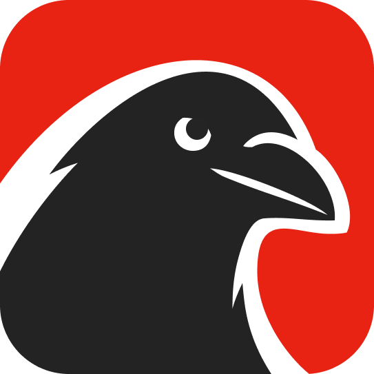

<p align="center">
  
</p>

<h3 align="center">crow.watch</h3>
<p align="center">a computing-focused community</p>

<p align="center">
  <a href="https://crow.watch">crow.watch</a>
</p>

---

Invite-only link aggregator and discussion platform for people who build tech. Share great links, cool code, and new tools.

### Stack

- **Go** — stdlib `net/http`, HTML templates, zero JS frameworks
- **PostgreSQL** — SQLc for type-safe queries, Goose migrations
- **Docker** — single `docker compose up` deployment

### Run

```sh
cp .env.example .env
docker compose up
```

### Why Crow?

Crows are smart, they work together, and they find the best shiny objects.
